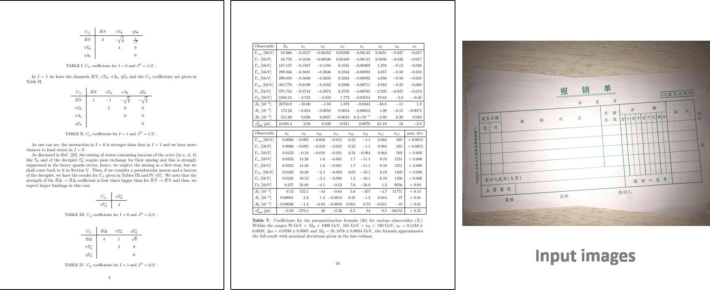
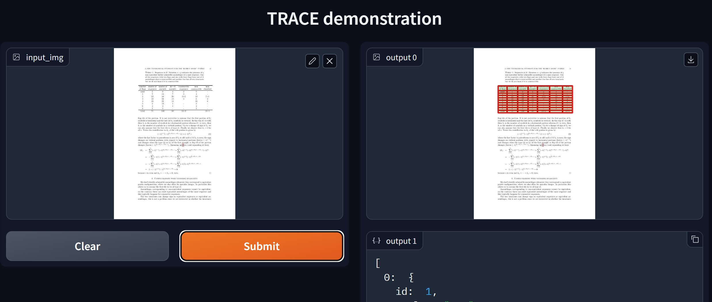
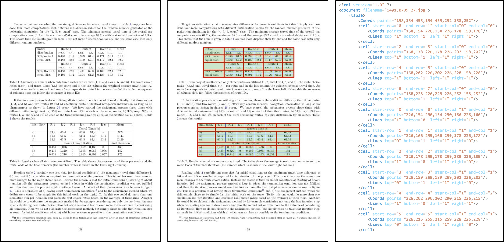

# TRACE: Table Reconstruction Aligned to Corner and Edges (ICDAR 2023)
The official implementation of [TRACE](https://arxiv.org/abs/2305.00630), a table reconstruction method for image documents. TRACE reconstructs tables in a bottom-up manner, starting from low-level features like corners and edges, and then progressing to cells. Finally, it is able to localize table positions by combining the detected cells.



## Updates

**_2024-03-13_** First commit. We released our code, model weights, dataset, and a new evaluation metric for end-to-end assessment.

## Requirements
- Python: >=3.7
- PyTorch: >=1.13.1

## Getting started
- Clone the repo with submodules
```bash
git clone --recurse-submodules https://github.com/clovaai/trace.git
```

- Install dependencies
```bash
pip install -r requirements.txt
```

## Pre-trained models and web demos

| Model name | Trained datasets | Model link (Google drive) | Desc. |
|---|---|---|---|
|TRACE-base|SubTableBank+SubIC19|[Link](https://drive.google.com/file/d/1TbzFE0YGtqlfN9cgAJP59nnEzo1dOcjJ/view?usp=sharing)|bordered and borderless tables|
|TRACE-WTW|WTW|[Link](https://drive.google.com/file/d/1KmVwLgbcHmEXwGKVeYfVIqF0yjTf0UKI/view?usp=sharing)|only for bordered tables|

1. Download the pre-trained model from the links.
2. You can run the Gradio-based demo with `./app.py` file with the sample images at `./samples`.

```bash
CUDA_VISIBLE_DEVICES=0 python app.py -c configs/trace_base.json --trained_model=weights/trace_base.pth --sample_path ./samples/ --port <port>
```



## Datasets

TRACE needs the cell bounding box annotations with edge visibility. So, we created a new dataset named `SubTableBank`. Rather than collecting new images, we sampled table images mainly from [TableBank](https://doc-analysis.github.io/tablebank-page/). The reason we sampled from TableBank is that the original data comes from various sources, and they contain a lot of borderless tables. Also, we additionally sampled from IC19 Modern only for the train set.

We've annotated the cell bounding box in sampled images with line visibility to each cell's edges. Note that when annotating borderless cells can have unclear boundaries. So, we guide annotators to designate an intermediate area between content included in the around cells. Our annotation file has the same XML format as [IC19](https://github.com/cndplab-founder/ctdar_measurement_tool)'s with the additional properties of cell line visibility. The following is an example of the annotation.




The data composition of datasets is as follows.

| Split | Sources | # of images |
|---|---|---|
| Train | TableBank(3885), IC19(102) | 3987 |
| Test  | TableBank(1000)            | 1000 |

### Getting datasets
#### SubTableBank
SubTableBank is the subset of TableBank dataset [TableBank](https://doc-analysis.github.io/tablebank-page/). Due to the redistribution policy of the original source, we only provide the XML annotation files for the sampled subset. You can copy the image files from the original dataset path using the following command.

```bash
python generate_subtablebank.py -s [path_to]/TableBank_data -t [path_to]/SubTableBank
```

* SubTableBank annotations: [link](https://drive.google.com/file/d/1KFrmsB6f5GyKDZTFLBmb4HXzJMsVFyhy/view?usp=sharing)

#### IC19
You can download SubIC19 from the [link](https://drive.google.com/file/d/1Qc2AcOX00SpyAzqk8jlMAFHNSH3zimEF/view?usp=sharing).
Once you have extracted the files, you can use them as a training set by copying them to the 'train' folder of SubTableBank.

#### WTW
If you intend to train the table in the wild, you may leverage the [WTW](https://github.com/wangwen-whu/WTW-Dataset) dataset, given its adherence to the same XML format. However, note that in WTW, implicit lines are treated as negative separators. Be mindful that mixing different types of datasets may have a negative impact.

## Training & Test Instructions

* Check Configurations (in the `./configs` directory)
  - The default filenames are `trace_base.json` for testing and `train_trace_[domain].json` for training.

* Training Instructions
```bash
CUDA_VISIBLE_DEVICES=0,1,2,3 python train.py -c [train_config_file] --batch_size=32 --save_folder=eval_[comment]/ --comment=_[comment]
```

* Testing Instructions
```bash
CUDA_VISIBLE_DEVICES=0 python test.py -c [config_file] -i [folder to have test files or a single file] -m [model_file]
```

```bash
CUDA_VISIBLE_DEVICES=0 python test.py -c configs/trace.json -i [file_folder] -m=[model_file]
```

  - Supported input types: images, pdf
  - You can generate intermediate heatmap images using the option `--save_heatmap`.

## Evaluation Results

As no published end-to-end table evaluation metric was found, we evaluate our method based on cell adjacency-relation with a loose cell matching technique. The base code was derived from [IC19 table metric](https://github.com/cndplab-founder/ctdar_measurement_tool). The evaluation code is integrated into this repository, and a detailed report will be published soon. The new metric is named Cell Adjacency Relation for Table Evaluation (CARTE), and the results are below.

<table>
    <thead align="center">
        <tr>
            <th>Dataset</th>
            <th>Recall</th>
            <th>Precision</th>
            <th>F1-score</th>
        </tr>
    </thead>
    <tbody align="center">
        <tr>
           <td>SubTableBank</td>
           <td>98.6</td>
           <td>95.2</td>
           <td>96.9</td>
        </tr>
        <tr>
           <td>WTW</td>
           <td>95.9</td>
           <td>98.2</td>
           <td>97.0</td>
        </tr>
    </tbody>
</table>

* Evaluation instruction
You can evaluate the results using CARTE metric.
``` (with python 3.8)

python evaluation/carte/eval.py -g [path_to]/SubTableBank/test/ -p ./results/
```


## Copyright
This repository is intended for non-commercial research purposes only. For commercial use, consider employing the CLOVA OCR service with table extraction functionality [here](https://www.ncloud.com/product/aiService/ocr).

## Acknowledgement

We extend our sincere gratitude to [TableBank](https://doc-analysis.github.io/tablebank-page/), [WTW](https://github.com/wangwen-whu/WTW-Dataset), and [IC19](https://github.com/cndplab-founder/ctdar_measurement_tool) for providing their datasets and evaluation metrics.

## Citation
```
@article{baek2023trace,
  title={TRACE: Table Reconstruction Aligned to Corner and Edges},
  author={Baek, Youngmin and Nam, Daehyun and Surh, Jaeheung and Shin, Seung and Kim, Seonghyeon},
  journal={arXiv preprint arXiv:2305.00630},
  year={2023}
}
```
## License

```
MIT License

Copyright (c) 2024-present NAVER Cloud Corp.

Permission is hereby granted, free of charge, to any person obtaining a copy
of this software and associated documentation files (the "Software"), to deal
in the Software without restriction, including without limitation the rights
to use, copy, modify, merge, publish, distribute, sublicense, and/or sell
copies of the Software, and to permit persons to whom the Software is
furnished to do so, subject to the following conditions:

The above copyright notice and this permission notice shall be included in all
copies or substantial portions of the Software.

THE SOFTWARE IS PROVIDED "AS IS", WITHOUT WARRANTY OF ANY KIND, EXPRESS OR
IMPLIED, INCLUDING BUT NOT LIMITED TO THE WARRANTIES OF MERCHANTABILITY,
FITNESS FOR A PARTICULAR PURPOSE AND NONINFRINGEMENT. IN NO EVENT SHALL THE
AUTHORS OR COPYRIGHT HOLDERS BE LIABLE FOR ANY CLAIM, DAMAGES OR OTHER
LIABILITY, WHETHER IN AN ACTION OF CONTRACT, TORT OR OTHERWISE, ARISING FROM,
OUT OF OR IN CONNECTION WITH THE SOFTWARE OR THE USE OR OTHER DEALINGS IN THE
SOFTWARE.
```
